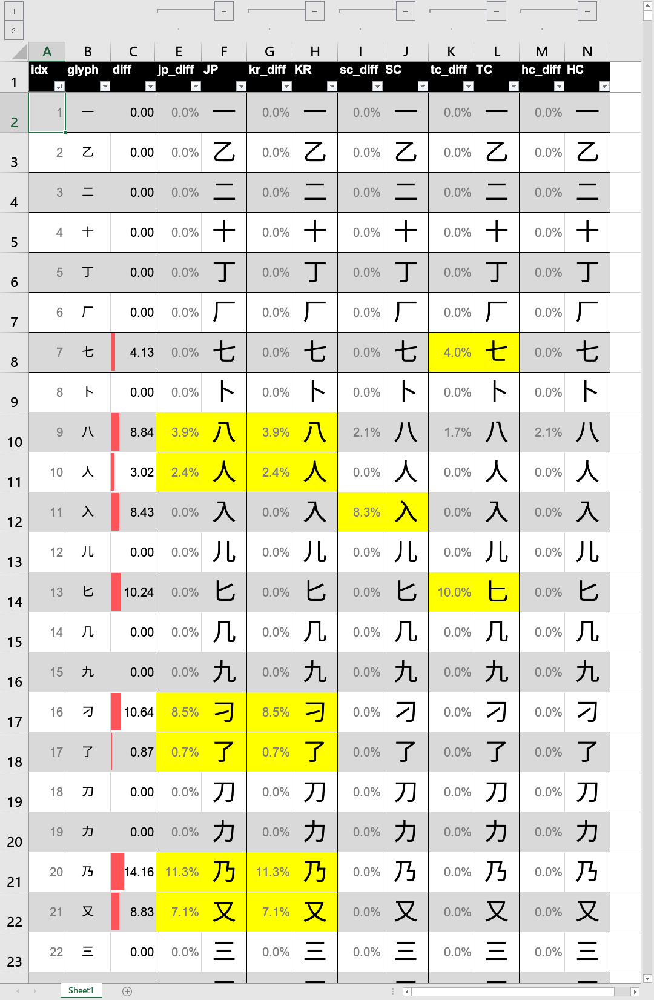
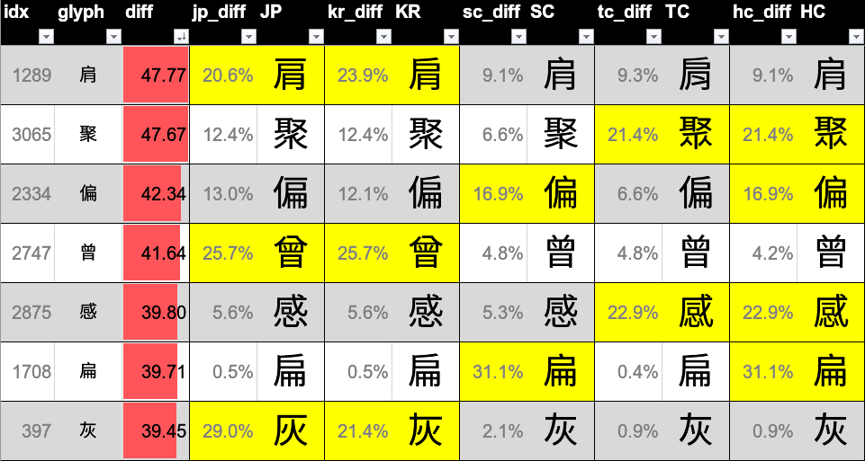

# 思源黑体 各地区字型比较

The difference of Source Han Sans Glyph in various regions

## 简述

-   思源黑体含五种地区
    
    -   Source Han Sans 日本
    -   Source Han Sans K 韩国
    -   Source Han Sans SC 大陆简中
    -   Source Han Sans TC 台湾繁中
    -   Source Han Sans HC 香港繁中
    
    同一个汉字在各个地区的字体中，字型会略有差异，笔画结构等等都会有些微的不同。为了比较和汇总这些差异，所以写了这么一个小项目。
-   比较用字是 [通用规范汉字表](https://zh.wikisource.org/wiki/%E9%80%9A%E7%94%A8%E8%A7%84%E8%8C%83%E6%B1%89%E5%AD%97%E8%A1%A8#fn_a1) 中的一级常用字 3500 字。
-   使用思源黑体 2.002 版本 ttc 文件，及各地区的 regular 字型。  
    [Release Fonts Version 2.002](https://github.com/adobe-fonts/source-han-sans/releases/tag/2.002R)
-   主要运行 `compare_character.py` 这个文件计算差异，生成结果是 `思源黑体各地区字型差异.xlsx` 。使用 excel 是考虑到可以直接看到效果，而不用生成太多图片文件。

## 字段说明

-   **idx** index 1~3500，用来辅助排序。

-   **glyph** 字

-   **diff** 把字打印成 64×64 像素的图片，计算逐个像素在五种不同地区字型中的标准差，然后求和。**diff 越大，表示该字五种字型的区别越大。** 常用字中，区别最大的是 「**肩**」。  
    

-   **JP/KR/SC/TC/HC** 直接在对应列可以看到该字在该地区的字型（需要先安装上述字体文件）。

-   **jp_diff 等** 是取各字型中同一个像素点的灰度值，比较当前字型的值和五个字型中间值的差异百分比，最终取当前字型所有像素点的差异值的平均数。这个值 **反应的是当前地区字型的特殊程度**，比如上图中的 「**入**」字，简中就和其它地区都不同。

    -   **黄色背景** 的，就是差异较大的字型。（大于五个地区 diff 值的均值就会变黄）

-   在 excel 中，还可以通过排序之类的查看字型的差异，归纳汇总各地区的字型特征。
